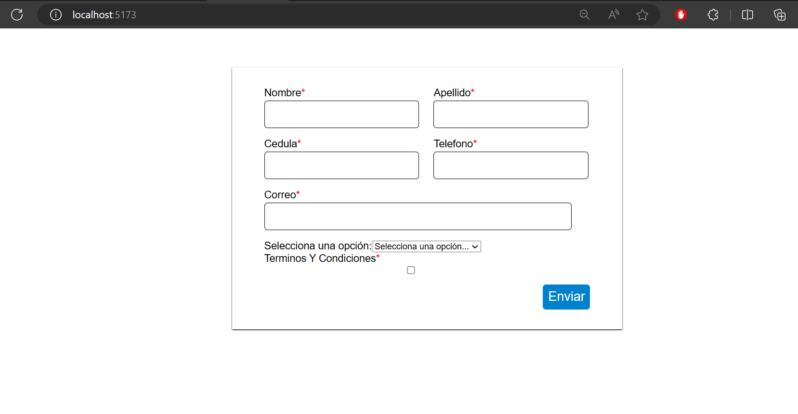
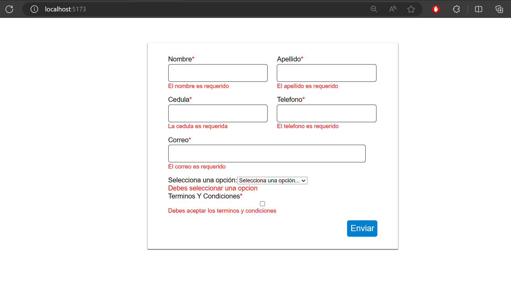
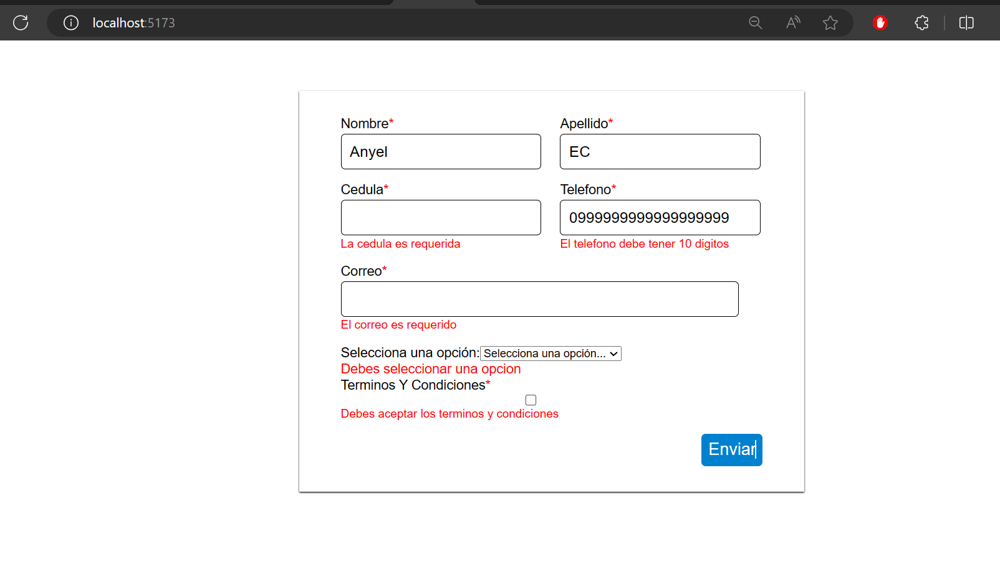

# Formulario de Validación con Formik y Styled-Components

Este es un proyecto de React que muestra un formulario de validación utilizando Formik para manejar el estado del formulario y Yup para las validaciones. Además, utiliza Styled-Components para estilizar los componentes.

## **Select Language:**
- [Español (Spanish)](README-es.md)
- [English](README.md)

## Result
### Home
 
### Validation 1
 
### Validation 2
 

## Instalación

Para instalar y ejecutar este proyecto en tu máquina local, sigue estos pasos:

1. Clona este repositorio en tu máquina local:

```
git clone https://github.com/Anyel-ec/Vite-React-FormValidation-Formik-Yup
```

2. Navega al directorio del proyecto:

```
cd formik-validation
```

3. Instala las dependencias del proyecto utilizando npm:

```
npm install
```

## Uso

Una vez que hayas clonado el repositorio y hayas instalado las dependencias, puedes iniciar el servidor de desarrollo ejecutando el siguiente comando:

```
npm run dev
```

Esto iniciará el servidor de desarrollo y podrás ver la aplicación en tu navegador web en la dirección [http://localhost:3000](http://localhost:3000).

## Funcionalidades

El formulario incluye los siguientes campos:

- Nombre: Permite ingresar solo texto y tiene una longitud máxima de 50 caracteres.
- Apellido: Permite ingresar solo texto y tiene una longitud máxima de 50 caracteres.
- Cedula: Permite ingresar solo números y debe tener exactamente 10 dígitos.
- Teléfono: Permite ingresar solo números y debe tener exactamente 10 dígitos.
- Correo electrónico: Debe ser un correo electrónico válido.
- Checkbox de aceptación de términos y condiciones.
- Selección de una opción entre tres posibles.

## Estructura del Proyecto

El proyecto tiene la siguiente estructura de archivos:

- `src/`: Contiene los archivos fuente de la aplicación.
  - `components/`: Contiene los componentes reutilizables.
    - `Input.js`: Componente reutilizable de entrada con validación.
  - `App.js`: Componente principal de la aplicación.
- `package.json`: Archivo de configuración de npm con las dependencias del proyecto.
- `README.md`: Este archivo que estás leyendo.

## Contribución

Si deseas contribuir a este proyecto, puedes abrir un problema o enviar una solicitud de extracción con tus mejoras.

## Licencia

Este proyecto está bajo la licencia MIT. Para más detalles, consulta el archivo [LICENSE](LICENSE).
